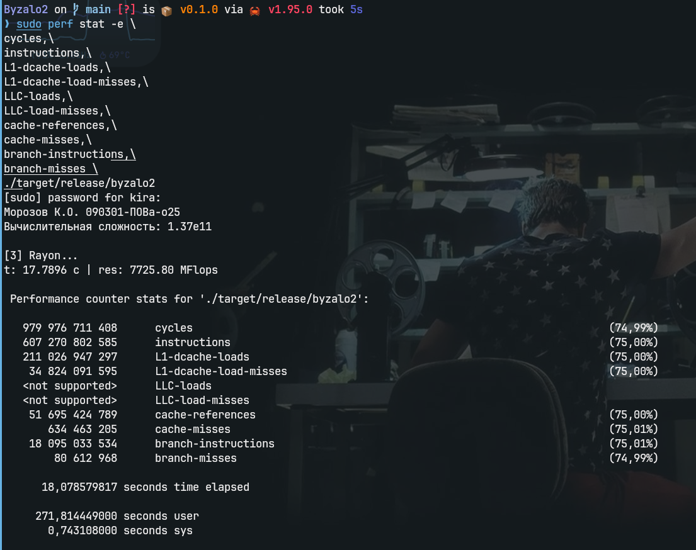

# Исследование производительности алгоритмов умножения матриц и оптимизация кэш-памяти

**Выполнил:** Морозов К.О., группа 090301-ПОВа-о25

## 1. Описание задачи и стенда
Целью работы являлось сравнение различных подходов к умножению плотных матриц размером $N = 4096$, состоящих из комплексных чисел двойной точности (`Complex64`). 

**Тестовый стенд:**
* **ОС:** CachyOS (Linux)
* **Процессор:** AMD Ryzen 7 5800HS (Zen 3, 8 физических ядер / 16 потоков)
* **Кэш:** L2 = 512 КБ на ядро, L3 = 16 МБ (общий)
* **Компилятор:** `rustc` с флагами оптимизации `opt-level=3` и `target-cpu=native`.

## 2. Базовые результаты и проблема "Стены памяти"
Первоначальный запуск включал три алгоритма. 

1. **[2] BLAS (cblas_zgemm):** ~2.33 с (58 908 MFlops)
2. **[3] Rayon (параллельный, с транспонированием матрицы B):** ~17.79 с (7 725 MFlops)
3. **[1] Наивный алгоритм (Bad algo):** Прерван вручную (`^C`), оценочное время выполнения — более 40 минут.

**Анализ базовых алгоритмов:**
Наивный алгоритм использует цикл `i-j-k`. При обращении к элементам матрицы $B$ (`b[k * N + j]`) происходит скачок по памяти с шагом в $N$ (4096 элементов = 65.5 КБ). Это приводит к 100% промахам (Cache Thrashing) мимо всех уровней кэша и TLB.

Чтобы исправить это, во второй версии (Rayon) матрица $B$ была предварительно транспонирована, а циклы распараллелены на 16 потоков. Аппаратное профилирование (`perf stat`) этой версии показало следующее:
* **Время:** 18.07 сек (реальное), 271.8 сек (процессорное — загружены все 16 потоков).
* **Инструкций за такт (IPC):** 0.62 (607 млрд инструкций / 979 млрд тактов).
* **Промахи L1-кэша:** 34.8 миллиарда.

Несмотря на 100% загрузку процессора, IPC составил всего **0.62**. Из-за отсутствия локальности данных (Data Reuse), процессору приходилось заново "прокачивать" через себя мегабайты данных из оперативной памяти для каждой строки. Алгоритм уперся в пропускную способность шины памяти (Memory Bandwidth Bound).

*(Здесь представлены результаты работы алгоритмов до блочной оптимизации)*

## 3. Оптимизация: Cache Blocking (Тайлинг)
Для решения проблемы "голодания" процессора был применен метод блочного умножения (Cache Blocking). Вычисления были разбиты на подматрицы размером `BLOCK_SIZE x BLOCK_SIZE`, чтобы рабочие данные постоянно находились в сверхбыстром L2-кэше ядра (512 КБ у Ryzen 7 5800HS), исключая лишние обращения к RAM. Порядок циклов изменен на аппаратно-дружелюбный `i-k-j`.

Было проведено профилирование (`perf stat`) для поиска оптимального размера блока:

| Версия / Размер блока | Время (с) | MFlops | IPC (Инстр/такт) | Промахи L1 (L1-misses) |
|:---:|:---:|:---:|:---:|:---:|
| Базовый Rayon (без блоков) | 17.79 | 7 725 | 0.62 | 34.8 млрд |
| Rayon (BLOCK = 64) | 12.48 | 11 009 | 1.08 | 32.6 млрд |
| Rayon (BLOCK = 128) | 10.69 | 12 847 | 1.17 | 23.3 млрд |
| Rayon (BLOCK = 256) | 11.17 | 12 300 | 1.04 | 21.3 млрд |
| **Rayon (BLOCK = 512)** | **10.40** | **13 211** | **2.08** | **19.3 млрд** |
| Rayon (BLOCK = 1024) | 18.69 | 7 352 | 1.80 | 21.9 млрд |

### Выводы по профилированию блочного алгоритма:

1. **Рост эффективности конвейера (IPC):** Размещение данных в L2-кэше позволило процессору перестать простаивать в ожидании памяти. Показатель IPC вырос с катастрофических 0.62 (в базовой версии) до **2.08** при оптимальном блоке.
2. **Конфликт SMT (Hyper-Threading) при блоках < 512:** При блоках 64-256 Rayon генерировал много задач и задействовал все 16 логических потоков. Из-за архитектуры Zen 3 два потока делят один L2-кэш ядра. В задачах с интенсивной памятью потоки затирали данные друг друга (IPC ~1.0).
3. **Оптимальная точка (BLOCK=512):** Матрица размером 4096 разбилась ровно на 8 крупных задач. Планировщик раздал их ровно на 8 физических ядер. Исключение SMT-конкуренции привело к удвоению IPC и лучшему времени выполнения — **10.4 секунды**.
4. **Голодание потоков (Thread Starvation) при BLOCK=1024:** Дальнейшее увеличение блока ухудшило результат (18.6 с). Причиной стало то, что матрица разбилась всего на 4 задачи ($4096 / 1024 = 4$). Планировщик смог загрузить только 4 физических ядра, оставив половину вычислительных мощностей ЦП в простое.

## 5. Заключение
Наивное распараллеливание алгоритма не дает максимального прироста производительности без учета иерархии памяти. 
Применение блочного умножения и профилирование (Hardware-Aware Tuning) позволили ускорить код на чистом Rust по сравнению с изначальной параллельной версией почти в 2 раза, снизив нагрузку на подсистему памяти и обеспечив IPC > 2.0.
Дальнейшее ускорение до уровня BLAS (~2.3 с) средствами компилятора ограничено сложностью автоматической AVX2/FMA векторизации структур комплексных чисел, что требует низкоуровневой упаковки данных (Data Packing) и микро-ядер на ассемблере.
