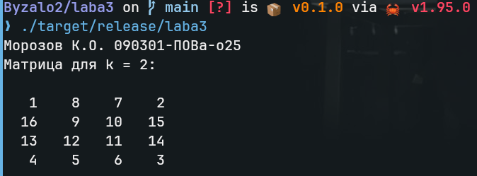

# Отчет по лабораторной работе

## 1. Постановка задачи

Квадрат разбит на $4^k$ равновеликих квадратных клеток. Квадрат перегибается поочередно относительно вертикальной (правая половина подкладывается под левую) и горизонтальной (нижняя половина подкладывается под верхнюю) оси симметрии до тех пор, пока все клетки не будут расположены друг под другом. 

Требуется занумеровать клетки исходного квадрата таким образом, чтобы в результате выполнения операций перегиба номера клеток, расположенных друг под другом, образовали числовую последовательность $1, 2, 3, \ldots, 4^k$, начиная с верхней клетки.

## 2. Метод решения и анализ алгоритма

Прямое моделирование процесса складывания путем манипуляций с двумерными массивами неэффективно, так как требует перераспределения памяти на каждом шаге и сложного контроля индексов.

Для решения применяется алгоритм обратного прохода (разворачивания). Известно, что после $2k$ сгибов образуется стопка из $4^k$ слоев размером $1 \times 1$ клетка. Задача сводится к поиску исходных координат $(X, Y)$ в развернутой матрице для каждого числа от 1 до $4^k$ из итоговой стопки.

Поскольку сгибы чередуются и их четное количество ($2k$), последним сгибом всегда является горизонтальный. Алгоритм моделирует отмену этих операций в обратном порядке:
1. Отмена горизонтального сгиба (разворот вниз).
2. Отмена вертикального сгиба (разворот вправо).

При каждом развороте текущая стопка слоев делится пополам:
- Верхняя половина стопки остается на месте.
- Нижняя половина перемещается в откидываемую часть. При этом, поскольку при складывании бумага уходила под низ, порядок слоев в откинутой части инвертируется.

Координаты каждого числа вычисляются итеративно. Временная сложность алгоритма составляет $O(4^k \cdot k)$, пространственная сложность (без учета выделения памяти под саму результирующую матрицу) — $O(1)$.

