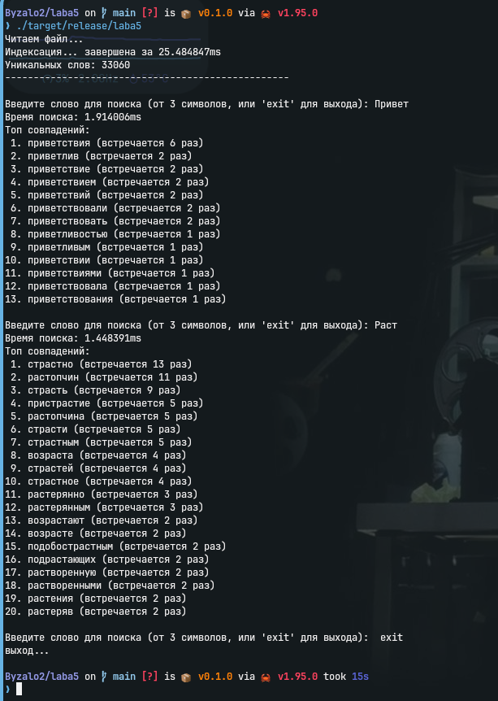

## 1. Постановка задачи
Реализовать поиск подстроки в текстовом файле на примере романа Л.Н. Толстого «Война и мир». 
Требования и ограничения:
* Минимальная длина поискового запроса: 3 символа.
* Вывод: первые 20 слов, содержащих введённую подстроку.
* Сортировка: по убыванию частоты вхождения слова в текст (частота как индекс релевантности).
* Время начальной обработки текста: $\le$ 1 мин.
* Время обработки одного запроса: $\le$ 2 с.

## 2. Результаты тестирования
Запуск программы производился в релизном профиле компилятора (флаг `--release`).

* **Время построения индекса:** ~23 мс
* **Время обработки запроса (на примере слова "Пока"):** ~0.65 мс (647 мкс)
* **Размер словаря уникальных слов:** 33 060

Реализация превосходит заданные временные ограничения на несколько порядков (индексация быстрее в ~2600 раз, поиск быстрее в ~3000 раз).

## 3. Техническое обоснование производительности

Сверхбыстрое время выполнения обусловлено использованием системного языка программирования Rust, LLVM-оптимизаций и архитектурных решений, направленных на эффективную утилизацию CPU и памяти:

### 3.1. Многопоточный Map-Reduce
Для первичной обработки текста (токенизация и подсчет частоты) вместо последовательного чтения или использования потокобезопасных структур с блокировками (Mutex/RwLock) применен паттерн Map-Reduce через библиотеку `rayon`. Текст разбивается на фрагменты (`par_split`), каждый поток CPU локально собирает свою хэш-таблицу частот (`fold`), после чего результаты сливаются воедино (`reduce`). Это полностью исключает простой потоков в ожидании разблокировки ресурсов (lock contention) и состояния гонки.

### 3.2. Параллельная нестабильная сортировка
Упорядочивание итогового словаря по частоте производится методом `par_sort_unstable_by`. Нестабильная сортировка работает быстрее стабильной и не требует дополнительных аллокаций памяти, так как не гарантирует сохранение первоначального порядка одинаковых элементов (что в рамках данной задачи не требуется). Распараллеливание этого процесса позволяет отсортировать 33 тысячи элементов за доли миллисекунды.

### 3.3. Zero-cost abstractions и работа с памятью
В процессе поиска по словарю не происходит выделения памяти под новые строки. Алгоритм итерируется по отсортированному вектору и возвращает вектор ссылок (`Vec<&(String, usize)>`) на оригинальные данные. Таким образом, на этапе обработки запроса куча (heap) практически не задействуется.

### 3.4. Cache-locality и линейный поиск
Поскольку количество уникальных слов в романе относительно невелико (~33 000), построение сложных поисковых структур (например, суффиксных деревьев или автоматов Ахо-Корасик) нецелесообразно. Данные хранятся в непрерывном массиве (векторе), что обеспечивает идеальную локальность кэша (cache locality) процессора. Линейный проход с фильтрацией `.contains()` по такому массиву отрабатывает за микросекунды, что с большим запасом укладывается в требуемые 2 секунды.

